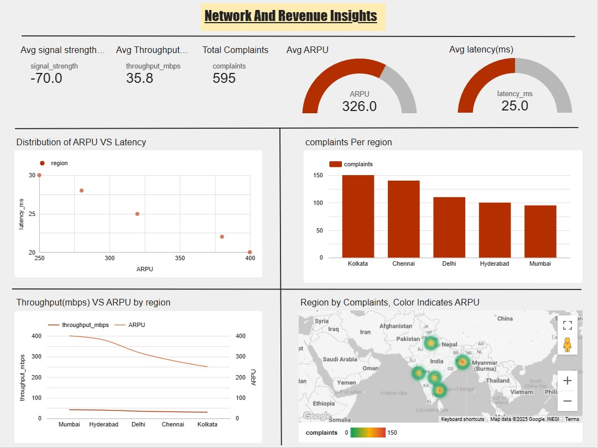

# Network-And-Revenue-Insights-Dashboard
View my interactive dashboard on [Google Looker Studio](https://lookerstudio.google.com/s/hMreT6jQiuE).


# Advanced AI/ML Telecom Analytics Project

## Overview
This repository contains the projects, models, and analytics work completed during the **5-Day Advanced AI/ML Training Program** organized by Nokia in collaboration with BSNL India, Telecom Sector Skill Council (TSSC), and hosted at Bharat Ratna Bhim Rao Ambedkar Institute of Telecom Training (BRBRAITT), Jabalpur.

The project focuses on applying Artificial Intelligence and Machine Learning techniques to real-world telecom industry use cases, with a primary emphasis on customer churn prediction, telecom analytics, and performance visualization.

---

## Project Objectives
- Predict customer churn using machine learning techniques
- Analyze telecom datasets to identify customer behavior patterns
- Generate actionable business insights for customer retention
- Build dashboards for monitoring telecom performance metrics
- Strengthen practical understanding of AI/ML workflows in telecom analytics

---

## Key Highlights
- Built an end-to-end churn prediction model with approximately **72% accuracy**
- Processed and analyzed **5,000+ telecom customer records**
- Developed ML models including:
  - Linear Regression
  - Decision Tree
- Designed an interactive **Looker Studio Dashboard** visualizing 8+ KPIs
- Generated insights to support customer retention strategies and risk analysis

---

## Features
### Customer Churn Prediction
- Predicts potential customer attrition using telecom usage data
- Identifies high-risk customers for proactive retention strategies

### Telecom Data Analytics
- Customer behavior analysis
- Usage trend identification
- Service performance evaluation
- Regional risk analysis

### Interactive Dashboard
- KPI visualization
- User behavior insights
- Service usage tracking
- Churn monitoring metrics

---

## Tech Stack
### Programming & Libraries
- Python
- Pandas
- NumPy
- Scikit-learn
- Matplotlib

### Visualization & Tools
- Power BI
- Looker Studio
- Jupyter Notebook
- Google Colab

---

## Machine Learning Workflow
1. Data Collection
2. Data Cleaning & Preprocessing
3. Feature Engineering
4. Exploratory Data Analysis (EDA)
5. Model Training
6. Model Evaluation
7. Dashboard Development
8. Insight Generation

---

## Dataset Information
The telecom dataset includes:
- Customer demographics
- Service usage details
- Call and internet usage patterns
- Subscription information
- Churn labels

Dataset Size:
- 5,000+ records
- Multiple telecom-related features and KPIs

---

## Model Performance
| Model | Purpose | Performance |
|------|------|------|
| Churn Prediction Model | Customer attrition prediction | ~72% Accuracy |
| Decision Tree | Risk region identification | Telecom analytics |
| Linear Regression | Trend and behavior analysis | Predictive insights |

---

## Dashboard KPIs
The Looker Studio dashboard includes:
- Customer churn rate
- Customer retention statistics
- Service usage trends
- Region-wise performance
- Revenue insights
- High-risk customer segments
- User engagement metrics
- Telecom operational KPIs

---

## Learning Outcomes
During this training program, the following skills and concepts were strengthened:
- Applied AI/ML concepts in telecom industry workflows
- Data preprocessing and feature engineering
- Machine learning model development and evaluation
- Telecom analytics and predictive modeling
- Data visualization and dashboard creation
- Business insight generation using AI

---

## Repository Structure
```bash
├── data/
│   ├── raw_data.csv
│   └── processed_data.csv
│
├── notebooks/
│   ├── data_preprocessing.ipynb
│   ├── exploratory_analysis.ipynb
│   └── churn_prediction_model.ipynb
│
├── models/
│   ├── churn_model.pkl
│   └── decision_tree_model.pkl
│
├── dashboard/
│   └── looker_studio_assets
│
├── images/
│   └── dashboard_screenshots
│
├── requirements.txt
└── README.md
```

---

## Future Improvements
- Improve model accuracy using advanced ensemble techniques
- Deploy the churn prediction model as a web application
- Integrate real-time telecom analytics pipelines
- Add deep learning-based customer behavior analysis
- Expand dashboard with advanced visualization metrics

---

## Acknowledgements
Special thanks to:
- Nokia
- BSNL India
- Telecom Sector Skill Council (TSSC)
- BRBRAITT Jabalpur

for organizing and delivering this advanced industry-oriented AI/ML training program.

